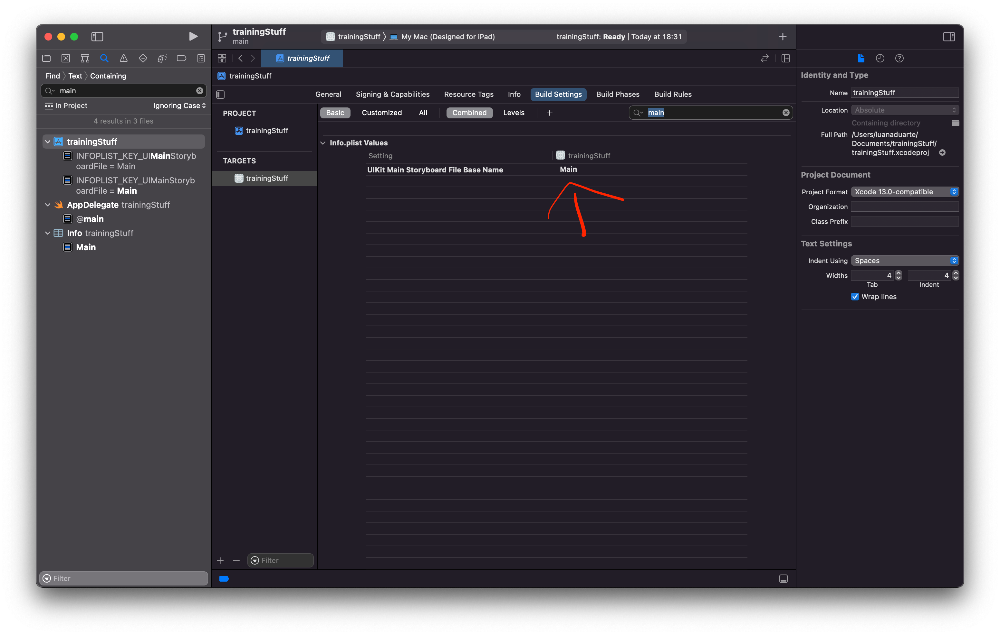
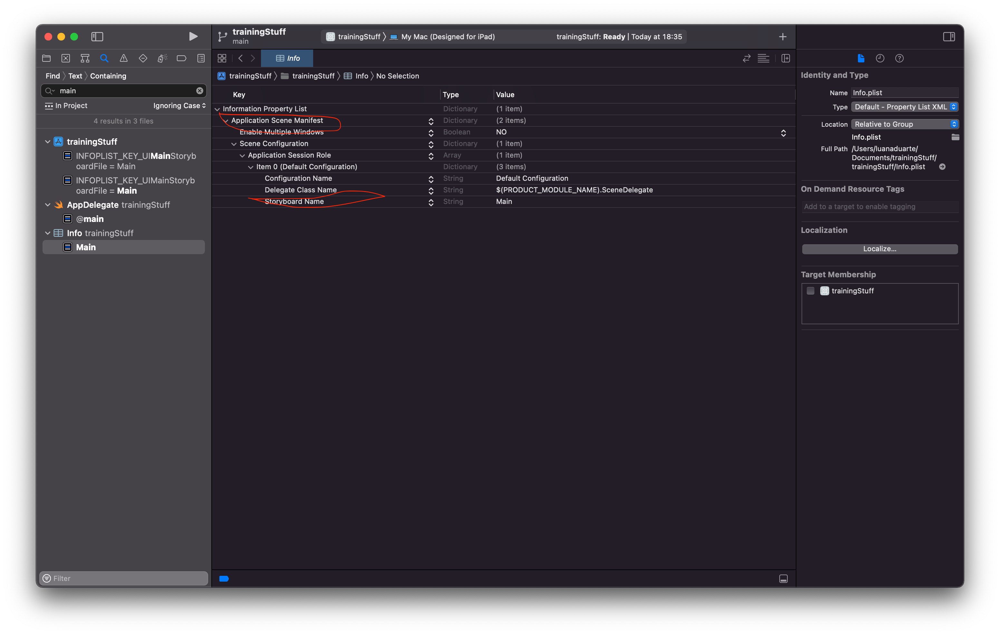

# View Code For Newbies

## Xcode without storyboard Tutorial

 - Create a new Project
 - Set interface to storyboard (not `swiftui`)
 - Delete the files `SceneDelegate` and `Main.storyboard`
 - Delete the entries following the pictures:



Finally create a file with:

```swift
import UIKit

@main
class AppDelegate: UIResponder, UIApplicationDelegate {
  var window: UIWindow?

  func application(
    _ application: UIApplication,
    didFinishLaunchingWithOptions launchOptions:
      [UIApplication.LaunchOptionsKey: Any]?
  ) -> Bool {
    window = UIWindow(frame: UIScreen.main.bounds)
    window?.makeKeyAndVisible()
    window?.rootViewController = ViewController()
    return true
  }
}
```


